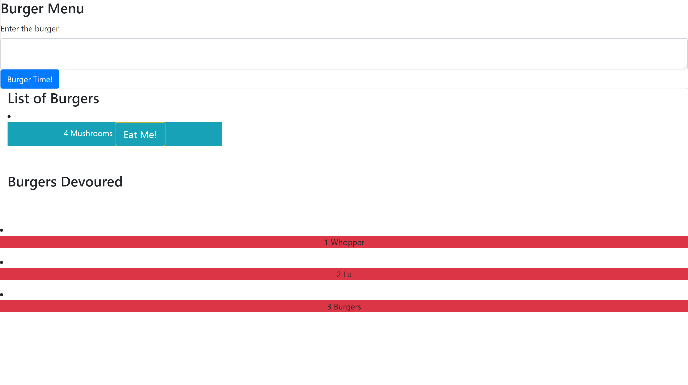

# BURGERZZZZ

## Application
This allows the user to add burgers via input to a list of burgerz and devour the by clicking the button "Eat me".

## Steps
* Upon loading the page user can input the burger they want.
* After pressing the "Burger Time" button the burger generates underneath in a seperate card. 
* You can then hit "Eat me" and the burger will be devoured! 

## Website link
https://hambuergerzzzzz45.herokuapp.com/

## Technology
* Handlebars
* Javascript
* MYSQL
* CSS
* HTML
* Express
* NodeJS 

## Screenshot

